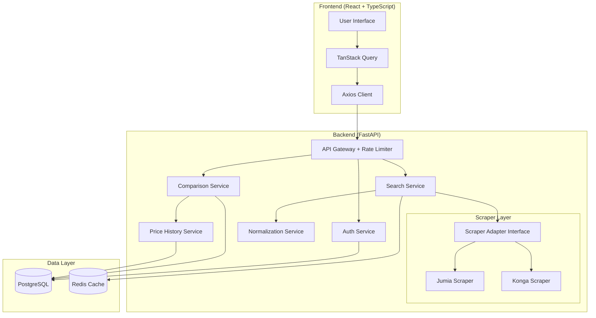

# Design Document: PriceCompare NG

## Overview

PriceCompare NG is a full-stack web application that aggregates product information from multiple Nigerian e-commerce platforms to provide users with instant price comparisons. The system consists of a FastAPI backend with modular architecture and a React + TypeScript frontend with professional UI design.

The architecture emphasizes:
- **Modularity**: Feature-based backend organization with clear boundaries
- **Extensibility**: Plugin-style platform adapters for easy addition of new e-commerce sites
- **Separation of concerns**: Routes handle HTTP, services contain business logic, scrapers handle data extraction
- **Type safety**: Strong typing on both frontend (TypeScript) and backend (Pydantic models)
- **Scalability**: Stateless API design with JWT authentication and efficient caching strategies

## Architecture

### High-Level Architecture



### Backend Architecture

**Directory Structure:**
```
backend/
├── app/
│   ├── core/
│   │   ├── config.py          # Environment configuration
│   │   ├── security.py        # JWT, password hashing
│   │   └── dependencies.py    # Dependency injection
│   ├── shared/
│   │   ├── models.py          # Shared Pydantic models
│   │   ├── exceptions.py      # Custom exceptions
│   │   └── utils.py           # Utility functions
│   ├── auth/
│   │   ├── routes.py          # Auth endpoints
│   │   ├── service.py         # Auth business logic
│   │   └── schemas.py         # Auth request/response models
│   ├── users/
│   │   ├── routes.py
│   │   ├── service.py
│   │   ├── models.py          # User database model
│   │   └── schemas.py
│   ├── search/
│   │   ├── routes.py
│   │   ├── service.py
│   │   └── schemas.py
│   ├── comparisons/
│   │   ├── routes.py
│   │   ├── service.py
│   │   ├── models.py          # Comparison database models
│   │   └── schemas.py
│   ├── scrapers/
│   │   ├── base.py            # ScraperAdapter interface
│   │   ├── jumia.py           # Jumia implementation
│   │   ├── konga.py           # Konga implementation
│   │   ├── registry.py        # Scraper registry
│   │   └── utils.py           # Scraping utilities
│   └── main.py                # FastAPI app initialization
├── alembic/                   # Database migrations
├── tests/
└── requirements.txt
```

**Key Architectural Patterns:**

1. **Feature-Based Modules**: Each feature (auth, search, comparisons) is self-contained with its own routes, services, and schemas
2. **Dependency Injection**: Services are injected into route handlers via FastAPI's Depends mechanism
3. **Adapter Pattern**: Platform scrapers implement a common interface, allowing easy addition of new platforms
4. **Service Layer**: Business logic lives in service classes, keeping routes thin and focused on HTTP concerns

### Frontend Architecture

**Directory Structure:**
```
frontend/
├── src/
│   ├── api/
│   │   ├── client.ts          # Axios instance configuration
│   │   ├── auth.ts            # Auth API calls
│   │   ├── search.ts          # Search API calls
│   │   └── comparisons.ts     # Comparison API calls
│   ├── components/
│   │   ├── common/
│   │   │   ├── Button.tsx
│   │   │   ├── Input.tsx
│   │   │   ├── LoadingSpinner.tsx
│   │   │   └── ErrorMessage.tsx
│   │   ├── search/
│   │   │   ├── SearchBar.tsx
│   │   │   └── SearchTypeToggle.tsx
│   │   ├── comparison/
│   │   │   ├── ComparisonCard.tsx
│   │   │   ├── ProductCard.tsx
│   │   │   ├── PriceChart.tsx
│   │   │   └── BestValueBadge.tsx
│   │   └── layout/
│   │       ├── Header.tsx
│   │       ├── Footer.tsx
│   │       └── Layout.tsx
│   ├── pages/
│   │   ├── Home.tsx
│   │   ├── Login.tsx
│   │   ├── Register.tsx
│   │   ├── SearchResults.tsx
│   │   └── SavedComparisons.tsx
│   ├── hooks/
│   │   ├── useAuth.ts
│   │   ├── useSearch.ts
│   │   └── useComparisons.ts
│   ├── types/
│   │   └── index.ts           # TypeScript type definitions
│   ├── utils/
│   │   ├── validation.ts
│   │   └── formatting.ts
│   ├── App.tsx
│   └── main.tsx
├── public/
└── package.json
```

**Key Frontend Patterns:**

1. **Custom Hooks**: Encapsulate TanStack Query logic for each API domain (auth, search, comparisons)
2. **Component Composition**: Small, focused components that compose into larger features
3. **Type Safety**: Comprehensive TypeScript types for all API responses and component props
4. **Form Validation**: React Hook Form + Zod for declarative, type-safe validation

## Components and Interfaces

### Backend Components

#### 1. Authentication Service

**Responsibilities:**
- User registration with password hashing
- User login with JWT token generation
- Token validation and user identification

**Interface:**
```python
class AuthService:
    def register_user(self, email: str, password: str) -> User:
        """Register a new user with hashed password"""
        
    def authenticate_user(self, email: str, password: str) -> Optional[User]:
        """Validate credentials and return user if valid"""
        
    def create_access_token(self, user_id: int) -> str:
        """Generate JWT token for authenticated user"""
        
    def verify_token(self, token: str) -> Optional[int]:
        """Validate JWT and return user_id if valid"""
```

**Dependencies:**
- `bcrypt` for password hashing
- `python-jose` for JWT operations
- User database model

#### 2. Search Service

**Responsibilities:**
- Coordinate keyword searches across all platforms
- Coordinate URL-based product lookups
- Orchestrate normalization of results
- Cache search results

**Interface:**
```python
class SearchService:
    def search_by_keyword(self, keyword: str) -> List[ComparisonResult]:
        """Search all platforms for keyword and return grouped results"""
        
    def search_by_url(self, url: str) -> ComparisonResult:
        """Extract product from URL and find similar products on other platforms"""
        
    def validate_url(self, url: str) -> Tuple[bool, Optional[str]]:
        """Validate URL belongs to supported platform, return (is_valid, platform_name)"""
```

**Dependencies:**
- Scraper registry
- Normalization service
- Redis cache

#### 3. Scraper Adapter Interface

**Responsibilities:**
- Define contract for platform-specific scrapers
- Provide common scraping utilities (retry logic, rate limiting)

**Interface:**
```python
from abc import ABC, abstractmethod
from dataclasses import dataclass

@dataclass
class ProductData:
    platform: str
    name: str
    price: float
    currency: str
    rating: Optional[float]
    review_count: int
    url: str
    availability: bool
    image_url: Optional[str]

class ScraperAdapter(ABC):
    @property
    @abstractmethod
    def platform_name(self) -> str:
        """Return platform identifier (e.g., 'jumia', 'konga')"""
        
    @abstractmethod
    def search_products(self, keyword: str, max_results: int = 10) -> List[ProductData]:
        """Search platform for keyword and return product data"""
        
    @abstractmethod
    def get_product_by_url(self, url: str) -> ProductData:
        """Extract product data from specific URL"""
        
    @abstractmethod
    def is_valid_url(self, url: str) -> bool:
        """Check if URL belongs to this platform"""
```

**Concrete Implementations:**
- `JumiaScraper(ScraperAdapter)`: Implements scraping for Jumia.com.ng
- `KongaScraper(ScraperAdapter)`: Implements scraping for Konga.com

**Scraping Strategy:**
- Use `httpx` for async HTTP requests
- Use `BeautifulSoup4` for HTML parsing
- Implement exponential backoff retry logic (3 attempts)
- Respect rate limits (configurable per platform)
- Handle parsing errors gracefully with detailed logging

#### 4. Normalization Service

**Responsibilities:**
- Group similar products from different platforms
- Calculate similarity scores based on product names
- Identify best value considering price, ratings, and availability

**Interface:**
```python
class NormalizationService:
    def group_similar_products(self, products: List[ProductData]) -> List[ComparisonResult]:
        """Group products by similarity and return comparison results"""
        
    def calculate_similarity(self, name1: str, name2: str) -> float:
        """Calculate similarity score between two product names (0.0 to 1.0)"""
        
    def identify_best_value(self, products: List[ProductData]) -> ProductData:
        """Determine which product offers best value"""
```

**Normalization Algorithm:**
1. Tokenize product names (remove common words like "the", "a", brand names)
2. Calculate Jaccard similarity between token sets
3. Group products with similarity > 0.6 threshold
4. Within each group, rank by: lowest price → highest rating → most reviews

#### 5. Price History Service

**Responsibilities:**
- Store price snapshots with timestamps
- Retrieve historical data for trend analysis
- Clean up old data (retain 90 days)

**Interface:**
```python
class PriceHistoryService:
    def record_price(self, product_url: str, platform: str, price: float) -> None:
        """Store price snapshot with current timestamp"""
        
    def get_price_history(self, product_url: str, platform: str, days: int = 30) -> List[PriceSnapshot]:
        """Retrieve price history for specified period"""
        
    def cleanup_old_data(self) -> int:
        """Remove price data older than 90 days, return count deleted"""
```

#### 6. Comparison Service

**Responsibilities:**
- Save comparison results for authenticated users
- Retrieve saved comparisons
- Manage user comparison limits

**Interface:**
```python
class ComparisonService:
    def save_comparison(self, user_id: int, comparison: ComparisonResult) -> SavedComparison:
        """Save comparison for user, enforce 50 comparison limit"""
        
    def get_user_comparisons(self, user_id: int) -> List[SavedComparison]:
        """Retrieve all saved comparisons for user"""
        
    def delete_comparison(self, user_id: int, comparison_id: int) -> bool:
        """Delete specific comparison, return success status"""
```

#### 7. Rate Limiting

**Responsibilities:**
- Protect API from abuse and excessive requests
- Track request counts per IP address and user
- Return appropriate error responses when limits exceeded

**Implementation:**
- Use `slowapi` library (FastAPI-compatible rate limiting)
- Built on top of `limits` library with Redis backend
- Provides decorators for easy route-level rate limiting
- Handles distributed rate limiting across multiple API instances

**Configuration:**
```python
from slowapi import Limiter, _rate_limit_exceeded_handler
from slowapi.util import get_remote_address
from slowapi.errors import RateLimitExceeded

# Initialize limiter with Redis storage
limiter = Limiter(
    key_func=get_remote_address,
    storage_uri="redis://localhost:6379"
)

# Register exception handler
app.add_exception_handler(RateLimitExceeded, _rate_limit_exceeded_handler)

# Apply to routes
@router.get("/search")
@limiter.limit("10/minute")  # Unauthenticated users
async def search_endpoint(request: Request):
    pass

@router.get("/comparisons")
@limiter.limit("60/minute")  # Authenticated users
async def protected_endpoint(request: Request, user: User = Depends(get_current_user)):
    pass
```

**Rate Limit Configuration:**
- Unauthenticated endpoints: 10 requests per minute per IP
- Authenticated endpoints: 60 requests per minute per user
- Custom limits for expensive operations (scraping): 5 requests per minute
- Returns 429 status code with `Retry-After` header when exceeded

**Dependencies:**
- `slowapi` for rate limiting decorators
- Redis for distributed storage and counting

### Frontend Components

#### 1. Search Interface

**Components:**
- `SearchBar`: Input field with keyword/URL toggle
- `SearchTypeToggle`: Switch between keyword and URL search modes
- Form validation using React Hook Form + Zod

**State Management:**
```typescript
const useSearch = () => {
  const searchByKeyword = useMutation({
    mutationFn: (keyword: string) => searchApi.searchByKeyword(keyword),
    onSuccess: (data) => {
      // Navigate to results page
    }
  });
  
  const searchByUrl = useMutation({
    mutationFn: (url: string) => searchApi.searchByUrl(url),
    onSuccess: (data) => {
      // Navigate to results page
    }
  });
  
  return { searchByKeyword, searchByUrl };
};
```

#### 2. Comparison Results Display

**Components:**
- `ComparisonCard`: Container for grouped product comparison
- `ProductCard`: Individual product display with price, rating, platform
- `BestValueBadge`: Visual indicator for best price
- `PriceChart`: Line chart showing price history (if available)

**Layout Strategy:**
- Grid layout for multiple comparisons
- Card-based design for each product
- Clear visual hierarchy: price (largest) → rating → reviews → platform
- Highlight best value with green border and badge

#### 3. Authentication Flow

**Components:**
- `LoginForm`: Email/password form with validation
- `RegisterForm`: Registration form with password confirmation
- Protected route wrapper using React Router

**Auth Hook:**
```typescript
const useAuth = () => {
  const login = useMutation({
    mutationFn: (credentials: LoginCredentials) => authApi.login(credentials),
    onSuccess: (data) => {
      localStorage.setItem('token', data.access_token);
      queryClient.invalidateQueries(['user']);
    }
  });
  
  const user = useQuery({
    queryKey: ['user'],
    queryFn: authApi.getCurrentUser,
    enabled: !!localStorage.getItem('token')
  });
  
  return { login, user, isAuthenticated: !!user.data };
};
```

## Data Models

### Backend Database Models

#### User Model
```python
class User(Base):
    __tablename__ = "users"
    
    id: int (primary key)
    email: str (unique, indexed)
    hashed_password: str
    created_at: datetime
    updated_at: datetime
    
    # Relationships
    saved_comparisons: List[SavedComparison]
```

#### SavedComparison Model
```python
class SavedComparison(Base):
    __tablename__ = "saved_comparisons"
    
    id: int (primary key)
    user_id: int (foreign key to users)
    search_query: str
    search_type: str  # 'keyword' or 'url'
    comparison_data: JSON  # Stores full ComparisonResult
    created_at: datetime
    
    # Relationships
    user: User
```

#### PriceHistory Model
```python
class PriceHistory(Base):
    __tablename__ = "price_history"
    
    id: int (primary key)
    product_url: str (indexed)
    platform: str
    price: float
    currency: str
    recorded_at: datetime (indexed)
    
    # Composite index on (product_url, platform, recorded_at)
```

### API Schemas (Pydantic)

#### Authentication Schemas
```python
class UserRegister(BaseModel):
    email: EmailStr
    password: str  # min_length=8
    
class UserLogin(BaseModel):
    email: EmailStr
    password: str
    
class Token(BaseModel):
    access_token: str
    token_type: str = "bearer"
    
class UserResponse(BaseModel):
    id: int
    email: str
    created_at: datetime
```

#### Search Schemas
```python
class KeywordSearchRequest(BaseModel):
    keyword: str  # min_length=2
    
class UrlSearchRequest(BaseModel):
    url: HttpUrl
    
class ProductDataResponse(BaseModel):
    platform: str
    name: str
    price: float
    currency: str
    rating: Optional[float]
    review_count: int
    url: str
    availability: bool
    image_url: Optional[str]
    
class ComparisonResultResponse(BaseModel):
    products: List[ProductDataResponse]
    best_value_index: int
    search_query: str
    timestamp: datetime
```

#### Comparison Schemas
```python
class SaveComparisonRequest(BaseModel):
    comparison_data: ComparisonResultResponse
    
class SavedComparisonResponse(BaseModel):
    id: int
    search_query: str
    search_type: str
    comparison_data: ComparisonResultResponse
    created_at: datetime
```

### Frontend TypeScript Types

```typescript
interface ProductData {
  platform: string;
  name: string;
  price: number;
  currency: string;
  rating: number | null;
  reviewCount: number;
  url: string;
  availability: boolean;
  imageUrl: string | null;
}

interface ComparisonResult {
  products: ProductData[];
  bestValueIndex: number;
  searchQuery: string;
  timestamp: string;
}

interface SavedComparison {
  id: number;
  searchQuery: string;
  searchType: 'keyword' | 'url';
  comparisonData: ComparisonResult;
  createdAt: string;
}

interface User {
  id: number;
  email: string;
  createdAt: string;
}
```

## Correctness Properties

*A property is a characteristic or behavior that should hold true across all valid executions of a system—essentially, a formal statement about what the system should do. Properties serve as the bridge between human-readable specifications and machine-verifiable correctness guarantees.*


### Property Reflection

After analyzing all acceptance criteria, I've identified several areas where properties can be consolidated:

**Authentication (1.1, 1.2, 1.3)**: These can be combined into a comprehensive authentication round-trip property that tests registration → login → token validation.

**Search completeness (2.4, 5.5)**: Both test that product data contains all required fields - can be consolidated into one property.

**Error handling across modules (2.5, 8.4)**: Both test fault isolation when components fail - can be combined into a general fault tolerance property.

**URL validation (3.1, 3.5, 11.3)**: All test URL validation behavior - can be consolidated into one comprehensive URL validation property.

**Rate limiting (9.1, 9.2, 9.3)**: These are specific examples of rate limiting behavior that should be tested as concrete examples rather than separate properties.

**Frontend state display (10.4, 10.5, 10.7, 15.3, 15.4)**: These all test UI state management and can be consolidated into properties about state transitions.

### Core Properties

Based on the prework analysis and reflection, here are the essential correctness properties:

**Property 1: Authentication round-trip preserves identity**
*For any* valid email and password, registering a user then logging in with those credentials should return a valid JWT token that identifies the same user.
**Validates: Requirements 1.1, 1.2**

**Property 2: Invalid credentials are rejected**
*For any* invalid credential combination (wrong password, non-existent email, malformed email), authentication attempts should fail with appropriate error messages.
**Validates: Requirements 1.3, 1.5**

**Property 3: Password validation enforces minimum length**
*For any* password string, registration should succeed only if the password length is at least 8 characters.
**Validates: Requirements 1.4**

**Property 4: Keyword search queries all registered platforms**
*For any* valid keyword, the search service should invoke the search method on every registered platform adapter.
**Validates: Requirements 2.1**

**Property 5: Similar products are grouped together**
*For any* set of products where multiple products have similarity scores above the threshold (0.6), those products should appear in the same comparison group.
**Validates: Requirements 2.2**

**Property 6: Product data contains all required fields**
*For any* product returned by the system, the product data should include name, price, currency, rating, review_count, url, availability, and platform.
**Validates: Requirements 2.4, 5.5**

**Property 7: Platform failures are isolated**
*For any* search operation where one platform adapter fails, the system should still return results from other functioning platforms and log the failure.
**Validates: Requirements 2.5, 8.4**

**Property 8: URL validation correctly identifies supported platforms**
*For any* URL string, the validation function should return true only if the URL matches the pattern of a registered platform adapter.
**Validates: Requirements 3.1, 3.5, 11.3**

**Property 9: URL-based search triggers cross-platform lookup**
*For any* valid product URL, extracting the product should trigger search operations on all other registered platforms.
**Validates: Requirements 3.3**

**Property 10: Price normalization produces consistent format**
*For any* price string extracted from a platform (with various formats like "₦1,234.56", "NGN 1234.56", "1234.56"), the normalized price should be a float value in the same currency unit.
**Validates: Requirements 4.2**

**Property 11: Scraping errors are handled gracefully**
*For any* malformed HTML or network error during scraping, the system should return a structured error response without crashing.
**Validates: Requirements 4.4**

**Property 12: Lowest price is correctly identified**
*For any* set of products in a comparison result, the product marked as best value should have the lowest price among available products.
**Validates: Requirements 5.1**

**Property 13: Best value considers multiple factors**
*For any* set of products with prices within 5% of each other, the best value calculation should prioritize higher ratings and more reviews.
**Validates: Requirements 5.2**

**Property 14: Price differences are calculated correctly**
*For any* pair of products, the displayed price difference should equal both the absolute difference and the percentage difference calculated from their prices.
**Validates: Requirements 5.3**

**Property 15: Out of stock products are indicated**
*For any* product with availability set to false, the product display should include an out-of-stock indicator.
**Validates: Requirements 5.4**

**Property 16: Price history is recorded on retrieval**
*For any* product data retrieved from a platform, a price history record should be created with the current timestamp, product URL, platform, and price.
**Validates: Requirements 6.1**

**Property 17: Price history retrieval returns associated data**
*For any* product URL and platform combination, retrieving price history should return only records matching that exact product and platform.
**Validates: Requirements 6.2, 6.5**

**Property 18: Price trends display only for sufficient data**
*For any* product, price trend visualization should be displayed only if price history records span at least 7 days.
**Validates: Requirements 6.3**

**Property 19: Saved comparisons are associated with users**
*For any* authenticated user and comparison result, saving the comparison should create a record associated with that user's ID.
**Validates: Requirements 7.1**

**Property 20: User retrieves only their own comparisons**
*For any* user requesting saved comparisons, the system should return only comparisons associated with that user's ID.
**Validates: Requirements 7.2**

**Property 21: Comparison deletion removes the record**
*For any* saved comparison, deleting it should result in that comparison no longer appearing in the user's saved comparisons list.
**Validates: Requirements 7.3**

**Property 22: Comparison limit is enforced**
*For any* user with 50 saved comparisons, attempting to save an additional comparison should fail with a limit error.
**Validates: Requirements 7.4, 7.5**

**Property 23: New platform adapters are automatically registered**
*For any* platform adapter implementing the ScraperAdapter interface, registering it should result in that platform being included in subsequent search operations.
**Validates: Requirements 8.2**

**Property 24: Rate limit violations are logged**
*For any* request that exceeds rate limits, a log entry should be created containing the IP address or user ID and timestamp.
**Validates: Requirements 9.5**

**Property 25: Loading states are displayed during API calls**
*For any* API request in progress, the UI should display a loading indicator until the request completes or fails.
**Validates: Requirements 10.4, 15.3**

**Property 26: Error states are displayed on API failures**
*For any* failed API request, the UI should display an error message and provide a retry option.
**Validates: Requirements 10.5, 15.4**

**Property 27: Empty states are displayed for no results**
*For any* search that returns zero results, the UI should display an empty state message with suggestions.
**Validates: Requirements 10.7**

**Property 28: Form validation prevents invalid submissions**
*For any* form with required fields, submitting the form with missing or invalid data should display field-specific error messages and prevent submission.
**Validates: Requirements 11.1, 11.2**

**Property 29: Keyword validation enforces minimum length**
*For any* search keyword, the system should reject keywords with fewer than 2 characters.
**Validates: Requirements 11.4**

**Property 30: Backend errors are sanitized in frontend display**
*For any* backend error response, the frontend should display a user-friendly message that does not expose technical implementation details.
**Validates: Requirements 11.5**

**Property 31: API responses are cached appropriately**
*For any* successful API response, subsequent identical requests within the cache validity period should return the cached response without making a new API call.
**Validates: Requirements 15.5**

## Error Handling

### Backend Error Handling Strategy

**Exception Hierarchy:**
```python
class PriceCompareException(Exception):
    """Base exception for all application errors"""
    pass

class AuthenticationError(PriceCompareException):
    """Raised for authentication failures"""
    pass

class ValidationError(PriceCompareException):
    """Raised for input validation failures"""
    pass

class ScrapingError(PriceCompareException):
    """Raised when scraping fails"""
    pass

class RateLimitError(PriceCompareException):
    """Raised when rate limits are exceeded"""
    pass

class ResourceNotFoundError(PriceCompareException):
    """Raised when requested resource doesn't exist"""
    pass
```

**Error Response Format:**
```python
class ErrorResponse(BaseModel):
    error: str           # Error type (e.g., "validation_error")
    message: str         # User-friendly message
    details: Optional[Dict[str, Any]]  # Additional context
    timestamp: datetime
```

**Error Handling Patterns:**

1. **Route Level**: Catch exceptions and convert to appropriate HTTP responses
   - `ValidationError` → 400 Bad Request
   - `AuthenticationError` → 401 Unauthorized
   - `ResourceNotFoundError` → 404 Not Found
   - `RateLimitError` → 429 Too Many Requests
   - `ScrapingError` → 503 Service Unavailable
   - Unexpected exceptions → 500 Internal Server Error (logged with full stack trace)

2. **Service Level**: Raise domain-specific exceptions with context
   - Include relevant details (which field failed validation, which platform failed)
   - Log errors with appropriate severity levels

3. **Scraper Level**: Implement retry logic with exponential backoff
   - Network errors: retry up to 3 times
   - Parsing errors: fail immediately with detailed error
   - Timeout errors: retry with increased timeout

### Frontend Error Handling Strategy

**Error State Management:**
```typescript
interface ErrorState {
  type: 'network' | 'validation' | 'server' | 'unknown';
  message: string;
  retryable: boolean;
  details?: Record<string, string>;
}
```

**Error Handling Patterns:**

1. **Network Errors**: Display "Connection failed" with retry button
2. **Validation Errors**: Display field-specific messages inline
3. **Server Errors**: Display generic "Something went wrong" with retry option
4. **Authentication Errors**: Redirect to login page
5. **Rate Limit Errors**: Display "Too many requests" with countdown timer

**Error Boundaries:**
- Wrap major sections in React Error Boundaries
- Catch rendering errors and display fallback UI
- Log errors to console (or error tracking service in production)

### Logging Strategy

**Backend Logging:**
- Use structured logging (JSON format)
- Log levels: DEBUG, INFO, WARNING, ERROR, CRITICAL
- Include request IDs for tracing
- Log all scraping failures with platform and URL
- Log all authentication failures with IP address
- Log all rate limit violations

**Frontend Logging:**
- Log API errors to console in development
- In production, send errors to monitoring service
- Include user context (authenticated/anonymous, user ID if available)

## Testing Strategy

### Overview

The testing strategy employs a dual approach combining unit tests for specific examples and edge cases with property-based tests for universal correctness properties. This ensures both concrete behavior validation and comprehensive input coverage.

### Property-Based Testing

**Library Selection:**
- **Backend (Python)**: Use `hypothesis` library for property-based testing
- **Frontend (TypeScript)**: Use `fast-check` library for property-based testing

**Configuration:**
- Minimum 100 iterations per property test
- Each test must reference its design document property in a comment
- Tag format: `# Feature: price-compare-ng, Property {number}: {property_text}`

**Property Test Examples:**

```python
# Backend property test example
from hypothesis import given, strategies as st

# Feature: price-compare-ng, Property 1: Authentication round-trip preserves identity
@given(
    email=st.emails(),
    password=st.text(min_size=8, max_size=100)
)
def test_auth_roundtrip_preserves_identity(email, password):
    # Register user
    user = auth_service.register_user(email, password)
    
    # Login with same credentials
    token = auth_service.authenticate_user(email, password)
    
    # Verify token identifies same user
    user_id = auth_service.verify_token(token)
    assert user_id == user.id
```

```typescript
// Frontend property test example
import fc from 'fast-check';

// Feature: price-compare-ng, Property 28: Form validation prevents invalid submissions
test('form validation prevents invalid submissions', () => {
  fc.assert(
    fc.property(
      fc.record({
        email: fc.string(),
        password: fc.string()
      }),
      (formData) => {
        const errors = validateLoginForm(formData);
        
        // If validation fails, form should not submit
        if (Object.keys(errors).length > 0) {
          expect(canSubmitForm(formData)).toBe(false);
        }
      }
    ),
    { numRuns: 100 }
  );
});
```

### Unit Testing

**Backend Unit Tests:**
- Test specific examples of business logic
- Test edge cases (empty strings, null values, boundary conditions)
- Test error conditions (invalid inputs, missing data)
- Mock external dependencies (database, HTTP requests)
- Use `pytest` as test runner
- Aim for >80% code coverage on service layer

**Frontend Unit Tests:**
- Test component rendering with various props
- Test user interactions (clicks, form submissions)
- Test state transitions
- Mock API calls using MSW (Mock Service Worker)
- Use `vitest` as test runner
- Use React Testing Library for component tests

**Unit Test Examples:**

```python
# Backend unit test example
def test_password_too_short_raises_validation_error():
    with pytest.raises(ValidationError) as exc_info:
        auth_service.register_user("test@example.com", "short")
    
    assert "at least 8 characters" in str(exc_info.value)

def test_empty_search_keyword_raises_validation_error():
    with pytest.raises(ValidationError) as exc_info:
        search_service.search_by_keyword("")
    
    assert "at least 2 characters" in str(exc_info.value)
```

```typescript
// Frontend unit test example
test('displays error message when login fails', async () => {
  const { getByLabelText, getByRole, findByText } = render(<LoginForm />);
  
  // Mock failed login
  server.use(
    rest.post('/api/auth/login', (req, res, ctx) => {
      return res(ctx.status(401), ctx.json({ error: 'Invalid credentials' }));
    })
  );
  
  // Submit form
  fireEvent.change(getByLabelText('Email'), { target: { value: 'test@example.com' } });
  fireEvent.change(getByLabelText('Password'), { target: { value: 'password' } });
  fireEvent.click(getByRole('button', { name: 'Login' }));
  
  // Verify error message is displayed
  expect(await findByText('Invalid credentials')).toBeInTheDocument();
});
```

### Integration Testing

**Backend Integration Tests:**
- Test complete API endpoints with real database (test database)
- Test authentication flow end-to-end
- Test search flow with mock scrapers
- Use `pytest` with database fixtures
- Run in CI/CD pipeline

**Frontend Integration Tests:**
- Test complete user flows (search → results → save)
- Test authentication flow (register → login → protected route)
- Use Playwright or Cypress for E2E tests
- Run against local backend instance

### Test Organization

**Backend Test Structure:**
```
tests/
├── unit/
│   ├── test_auth_service.py
│   ├── test_search_service.py
│   ├── test_normalization_service.py
│   └── test_scrapers.py
├── property/
│   ├── test_auth_properties.py
│   ├── test_search_properties.py
│   └── test_comparison_properties.py
├── integration/
│   ├── test_auth_api.py
│   ├── test_search_api.py
│   └── test_comparison_api.py
└── conftest.py  # Shared fixtures
```

**Frontend Test Structure:**
```
src/
├── components/
│   ├── SearchBar.test.tsx
│   ├── ProductCard.test.tsx
│   └── ComparisonCard.test.tsx
├── hooks/
│   ├── useAuth.test.ts
│   └── useSearch.test.ts
├── property-tests/
│   ├── validation.property.test.ts
│   └── state-management.property.test.ts
└── e2e/
    ├── search-flow.spec.ts
    └── auth-flow.spec.ts
```

### Testing Priorities for MVP

Since this is an MVP without automated tests initially, when tests are added, prioritize:

1. **Critical Path Property Tests**: Authentication, search, comparison (Properties 1-9)
2. **Data Integrity Unit Tests**: Price normalization, product data completeness
3. **Error Handling Unit Tests**: Validation errors, scraping failures
4. **Integration Tests**: Complete search flow, authentication flow

### Continuous Integration

**CI Pipeline (when implemented):**
1. Run linters (flake8, eslint)
2. Run type checkers (mypy, TypeScript compiler)
3. Run unit tests (backend and frontend)
4. Run property tests (backend and frontend)
5. Run integration tests
6. Generate coverage reports
7. Fail build if coverage drops below 80%

## Implementation Notes

### Git Version Control Strategy

**Repository Initialization:**
```bash
git init
git add .
git commit -m "Initial commit: Project structure"
```

**Branch Strategy:**
- `main`: Production-ready code
- `develop`: Integration branch for features
- `feature/*`: Individual feature branches (e.g., `feature/auth`, `feature/search`)
- `bugfix/*`: Bug fix branches

**Commit Guidelines:**
- Use meaningful, atomic commits
- Follow conventional commit format: `type(scope): description`
  - `feat`: New feature
  - `fix`: Bug fix
  - `docs`: Documentation changes
  - `refactor`: Code refactoring
  - `test`: Adding tests
  - `chore`: Maintenance tasks
- Examples:
  - `feat(auth): implement JWT authentication`
  - `fix(scraper): handle timeout errors gracefully`
  - `docs(readme): add setup instructions`

**Gitignore Configuration:**

Backend (.gitignore):
```
# Python
__pycache__/
*.py[cod]
*$py.class
*.so
.Python
venv/
env/
ENV/

# Database
*.db
*.sqlite3

# Environment
.env
.env.local

# IDE
.vscode/
.idea/
*.swp
*.swo

# Testing
.pytest_cache/
.coverage
htmlcov/

# Logs
*.log
```

Frontend (.gitignore):
```
# Dependencies
node_modules/
.pnp
.pnp.js

# Production
dist/
build/

# Environment
.env
.env.local
.env.production

# IDE
.vscode/
.idea/
*.swp
*.swo

# Testing
coverage/

# Logs
npm-debug.log*
yarn-debug.log*
yarn-error.log*

# OS
.DS_Store
Thumbs.db
```

**Git Workflow:**
1. Create feature branch from `develop`
2. Make atomic commits with clear messages
3. Push feature branch to remote
4. Create pull request to `develop`
5. Code review and approval
6. Merge to `develop`
7. Periodically merge `develop` to `main` for releases

### Development Workflow

1. **Initial Setup**:
   - Initialize Git repository with proper .gitignore
   - Create directory structure (frontend/, backend/)
   - Set up virtual environment (backend) and npm project (frontend)
   - Create .env.example files
   - Make initial commit

2. **Backend Development Order**:
   - Core configuration and security utilities
   - Database models and migrations
   - Authentication service and routes
   - Scraper base interface and implementations
   - Search service and routes
   - Comparison service and routes
   - Price history service

3. **Frontend Development Order**:
   - Project setup (Vite, TailwindCSS, routing)
   - API client configuration
   - Authentication pages and hooks
   - Search interface
   - Comparison results display
   - Saved comparisons page

4. **Integration**:
   - Connect frontend to backend API
   - Test complete user flows
   - Handle CORS configuration
   - Deploy to staging environment

### Security Considerations

1. **Password Security**:
   - Use bcrypt with appropriate cost factor (12-14)
   - Never log passwords
   - Enforce minimum password requirements

2. **JWT Security**:
   - Use strong secret key (minimum 32 characters)
   - Set appropriate expiration (1 hour for access tokens)
   - Include user ID and email in token payload
   - Validate token signature on every protected route

3. **API Security**:
   - Implement rate limiting on all endpoints
   - Validate all inputs with Pydantic models
   - Sanitize error messages (don't expose stack traces)
   - Use HTTPS in production
   - Implement CORS with specific allowed origins

4. **Scraping Ethics**:
   - Respect robots.txt
   - Implement rate limiting per platform
   - Use appropriate User-Agent headers
   - Cache results to minimize requests
   - Handle failures gracefully without retrying excessively

### Performance Considerations

1. **Backend Performance**:
   - Use async/await for scraping operations (concurrent requests)
   - Implement Redis caching for search results (5-minute TTL)
   - Use database indexes on frequently queried fields
   - Implement connection pooling for database
   - Use pagination for saved comparisons list

2. **Frontend Performance**:
   - Lazy load routes with React.lazy()
   - Implement virtual scrolling for long product lists
   - Optimize images (lazy loading, appropriate sizes)
   - Use TanStack Query caching to minimize API calls
   - Debounce search input (300ms delay)

3. **Scraping Performance**:
   - Use connection pooling for HTTP requests
   - Implement timeout limits (10 seconds per request)
   - Run platform scrapers concurrently
   - Cache product data for 5 minutes

### Scalability Considerations

1. **Horizontal Scaling**:
   - Stateless API design (JWT tokens, no server-side sessions)
   - Externalize cache (Redis) and database (PostgreSQL)
   - Use load balancer for multiple API instances

2. **Database Scaling**:
   - Implement database indexes strategically
   - Consider read replicas for heavy read operations
   - Archive old price history data (>90 days)

3. **Scraping Scaling**:
   - Consider moving scraping to background workers (Celery)
   - Implement job queue for scraping tasks
   - Distribute scraping across multiple workers

### Monitoring and Observability

1. **Metrics to Track**:
   - API response times
   - Scraping success/failure rates per platform
   - Authentication success/failure rates
   - Rate limit violations
   - Database query performance

2. **Logging**:
   - Structured JSON logs
   - Include request IDs for tracing
   - Log all errors with context
   - Separate log levels for different environments

3. **Alerting** (future consideration):
   - Alert on high error rates
   - Alert on scraping failures
   - Alert on database connection issues
   - Alert on high API latency
