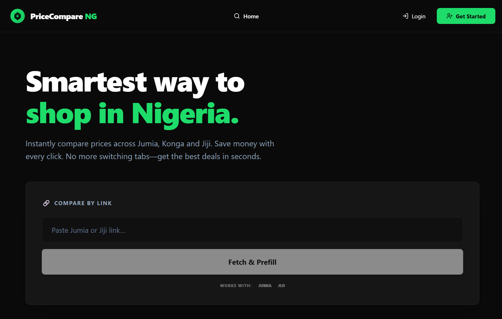
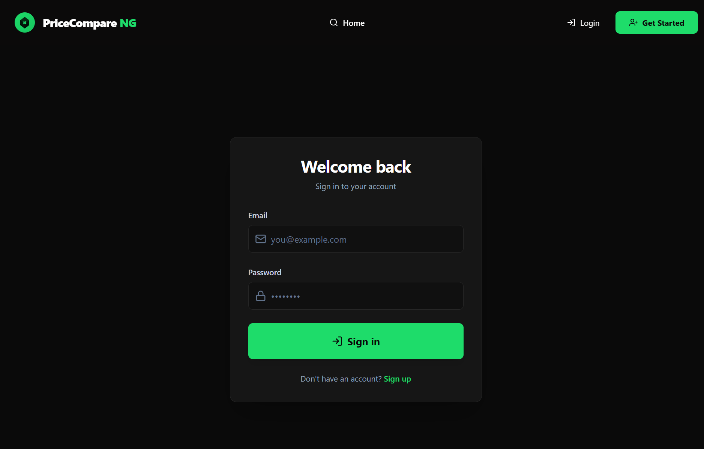
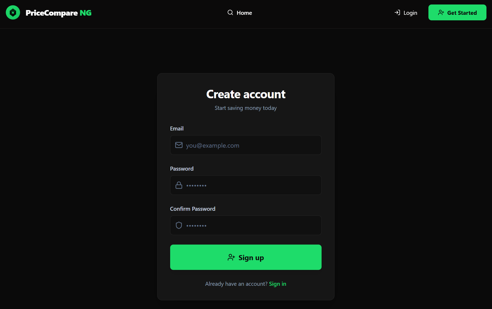

# 🛒 PriceCompare NG

<div align="center">


**Compare prices across Jumia, Konga & Jiji in seconds**

[Live Demo](https://price-compare-ng-frontend.onrender.com) • [API](https://price-compare-ng-backend.onrender.com/api-docs)

</div>

---

## 🎯 The Problem

Nigerian e-commerce shoppers waste time switching between tabs to compare prices across platforms. Often, they miss better deals or buy from overpriced sellers.

**PriceCompare NG solves this** by aggregating product data from multiple Nigerian e-commerce platforms into one unified interface.

## ✨ Key Features

| Feature | Description |
|---------|-------------|
| **🔗 URL Search** | Paste any Jumia/Jiji link → instantly find similar products with price comparisons |
| **🔍 Keyword Search** | Search across all platforms with price range and rating filters |
| **💾 Save Comparisons** | Keep track of products you're interested in (up to 50 saved items) |
| **⭐ Best Value Badge** | Automatically highlights the best deal based on price, rating, and availability |
| **📱 Mobile Responsive** | Fully optimized for mobile with animated hamburger menu |
| **🔒 Secure Auth** | JWT-based authentication with bcrypt password hashing |

## 🏗️ Architecture Highlights

### Scalable Backend Design
- **Modular architecture** with separated service layer for business logic
- **Adapter pattern** for platform scrapers - easy to add new e-commerce platforms
- **Rate limiting** to prevent API abuse (10 req/min unauth, 60 req/min auth)
- **Zod validation** for type-safe API contracts

### Modern Frontend
- **TanStack Query** for intelligent data fetching and caching
- **Framer Motion** for smooth animations
- **React Hook Form + Zod** for performant form validation
- **Custom hooks** for clean separation of concerns

### Tech Stack

**Backend:** Express.js, TypeScript, Prisma ORM, PostgreSQL, JWT, Cheerio

**Frontend:** React 18, Vite, TailwindCSS, Framer Motion, TanStack Query, React Router

## 🚀 Live Demo

Try it now: [price-compare-ng-frontend.onrender.com](https://price-compare-ng-frontend.onrender.com)

- **Test Account:** Register your own account or browse without login
- **Sample Search:** Try searching for "iPhone 15" or paste any Jumia product link

## 📸 Screenshots

<div align="center">
  
  
</div>

<div align="center">
  
  
</div>

<div align="center">
  
  
</div>

## 💡 What I Learned

Building this project taught me:

- **Web Scraping Challenges** - Handling dynamic content, rate limits, and HTML parsing across different site structures
- **Database Design** - Designing schemas for many-to-many relationships and implementing unique constraints
- **Type Safety** - Leveraging TypeScript across the full stack to catch errors at compile time
- **State Management** - Using TanStack Query for server state vs React state for UI state
- **Authentication Flow** - Implementing secure JWT auth with proper token management
- **Mobile-First Design** - Building responsive UIs that work great on all devices
- **Deployment** - Configuring CI/CD on Render with PostgreSQL migrations

## 🔮 Future Enhancements

- [ ] Price history tracking and alerts
- [ ] Email notifications for price drops
- [ ] Chrome extension for one-click price comparisons
- [ ] Support for more Nigerian e-commerce platforms
- [ ] Product review aggregation

## 🛠️ Quick Start

### Prerequisites
- Node.js 18+
- PostgreSQL 13+

### Installation

```bash
# Clone the repo
git clone https://github.com/yourusername/price-compare-ng.git
cd price-compare-ng

# Backend setup
cd backend
npm install
cp .env.example .env
# Update .env with your DATABASE_URL and JWT_SECRET
npx prisma migrate dev
npm run dev

# Frontend setup (new terminal)
cd frontend
npm install
cp .env.example .env
# Update VITE_API_BASE_URL if needed
npm run dev
```

Visit `http://localhost:5173`

## 📂 Project Structure

```
├── backend/
│   ├── src/
│   │   ├── api/v1/        # Route handlers + service layer
│   │   ├── scrapers/      # Platform adapters (Jumia, Konga, Jiji)
│   │   ├── middleware/    # Auth, rate limiting, error handling
│   │   └── config/        # Environment validation
│   └── prisma/           # Database schema and migrations
├── frontend/
│   ├── src/
│   │   ├── components/   # Reusable UI components
│   │   ├── pages/        # Route-level pages
│   │   ├── hooks/        # Custom React hooks
│   │   └── api/          # API client functions
```

## 🧪 Testing

```bash
# Backend tests
cd backend
npm test

# Frontend linting
cd frontend
npm run lint
```

## 📄 License

MIT License - feel free to use this project for learning or inspiration.

---

<div align="center">
Built with ❤️ for Nigerian shoppers
</div>
